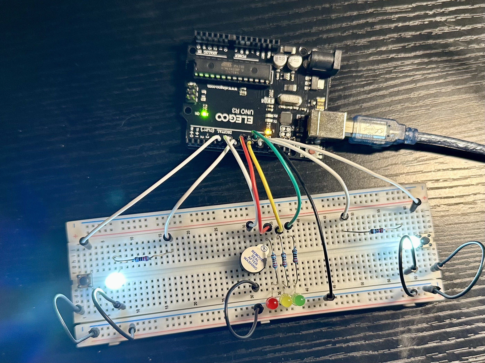

# Arduino Two-Player Reaction Speed Game
## Demo
Game running: https://youtube.com/shorts/ruQGkITBvoQ?feature=share

# Overview

This project is a two-player reaction speed game built using Arduino.

It simulates a racing start system. Players wait through a timed light sequence. When the signal appears, both players react as fast as possible. The first button press wins the round.

The system uses random delay timing to prevent prediction and improve fairness.

# Features

Two-player competitive gameplay

Randomized start delay

Audio feedback using buzzer

Automatic round reset

Clean digital input handling using INPUT_PULLUP

Simple and expandable design

# Hardware Components

Arduino Uno

5 LEDs (Green, Yellow, Red, 2 White)

2 Push buttons

Piezo buzzer

Resistors

Breadboard and jumper wires

# System Behavior

Green LED turns on with sound

Yellow LED turns on with sound

Red LED turns on

Random delay between 900 ms and 4900 ms

White LEDs turn on (reaction signal)

First detected button press ends the round

Buzzer announces the result

System resets for next round

# Technical Details

Uses randomSeed(analogRead(A0)) to generate unpredictable timing

Buttons configured with INPUT_PULLUP to reduce external components

Uses blocking delays for timing control

Uses a while loop to detect first input event

# Skills Demonstrated

Embedded systems programming

Digital I/O control

Event detection logic

Random timing implementation

Hardware debugging and wiring

Basic game logic design

# Future Improvements

Measure and display reaction time in milliseconds

Add scoreboard using LCD or Serial Monitor

Implement non-blocking timing using millis()

Add false start detection

Expand to multiplayer mode
